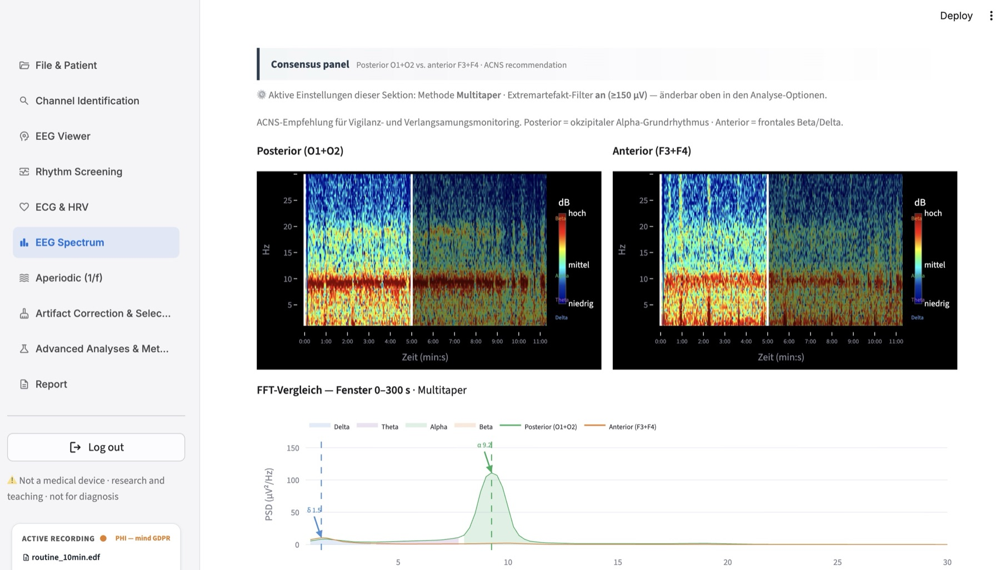
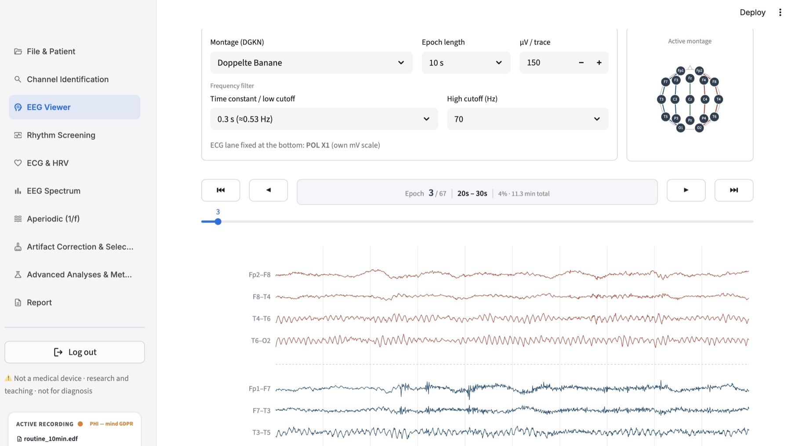
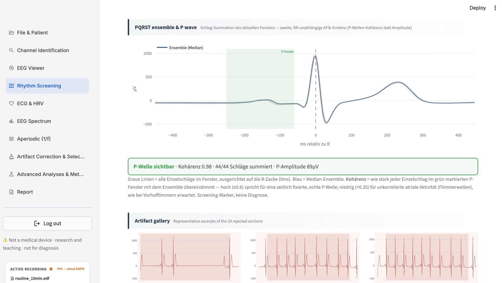
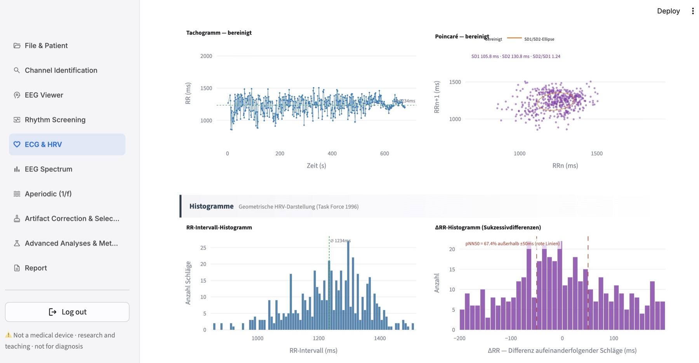
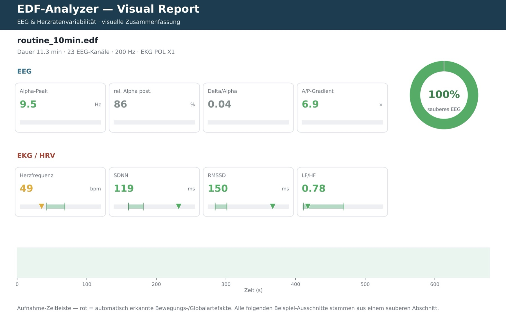

# EDF-Analyzer

**[English](README.md) · Deutsch**

**Ein browserbasiertes Forschungs- und Lehrwerkzeug zur quantitativen Auswertung von EEG- und EKG-Aufzeichnungen im European Data Format (EDF).** Es leitet aus Routine-Aufnahmen quantitative neurophysiologische und autonome (HRV-)Kennwerte ab — mit strikter Trennung zwischen bewährten Standard-Methoden und Zusatzverfahren, und mit einer ausdrücklichen Angabe, worauf der Beleg für jedes Verfahren tatsächlich beruht.

[](https://github.com/maximilianhabs/edf-analyzer/actions/workflows/test.yml)


> ⚠️ **Kein Medizinprodukt, keine Diagnosesoftware.** Der EDF-Analyzer ist ein Werkzeug für Forschung, methodische Exploration und Lehre. Alle ausgegebenen Werte sind **Orientierung**, keine Diagnosekriterien, und ersetzen keine ärztliche Befundung.

---

## Was es macht

Man lädt eine EDF-Datei hoch; die App erkennt automatisch die Kanaltypen (EEG/EKG/EOG/…), berechnet quantitative Marker (EEG-Spektralanalyse, HRV-Zeit- und Frequenzdomäne, Aperiodik, Komplexität) und erlaubt eine artefaktbereinigte Gegenauswertung sowie tabellarische und visuelle Reports.



*EEG-Spektrum: posterior (O1+O2) gegen anterior (F3+F4). Das Alpha-Band bei 9,2 Hz zieht sich als roter Streifen durch das posteriore Spektrogramm und bricht dort ab, wo die Augen geöffnet werden — Alpha-Reaktivität, im Frequenzbild sichtbar. Die weiße Säule markiert eine Aufnahmelücke.*

<details>
<summary><b>Weitere Screenshots</b> — EEG-Viewer, Rhythmus-Screening, HRV, visueller Report</summary>



*Vollaufnahme mit scrollbarer Navigation, DGKN-Montagen, Eichung je Kanal und fest unten liegender EKG-Spur.*



*Schlag-Summation über das Fenster: jeder Einzelschlag auf die R-Zacke ausgerichtet, das Median-Ensemble in Blau. Die P-Wellen-Kohärenz ist eine von der RR-Unregelmäßigkeit unabhängige Evidenz — Screening-Marker, keine Diagnose. Darunter zeigt die Artefaktgalerie, was verworfen wurde und warum.*



*Tachogramm, Poincaré-Darstellung und die geometrische HRV-Darstellung (Task Force 1996).*



*Der visuelle Report als Vektor-PDF — jede Seite trägt den Haftungshinweis und ihre Herkunftszeile: Version, Commit, Python- und Paketversionen, Analyse-Fingerabdruck.*

</details>

Alle Screenshots stammen aus einer **echten Routine-EEG-Aufnahme** (11 Minuten, 23 EEG-Kanäle, 200 Hz), nicht aus synthetischen Testdaten. Die Kopfdaten wurden vorher anonymisiert; nichts Identifizierendes ist sichtbar.


## Warum es existiert

Kommerzielle EEG/EKG-Systeme geben quantitative Kennwerte oft als Blackbox aus — die zugrundeliegende Methodik ist selten transparent, herstellerabhängig und schwer nachzuvollziehen. Der EDF-Analyzer macht die Rechenwege **explizit und nachvollziehbar**: für jedes Verfahren ist dokumentiert, ob es einem publizierten Goldstandard folgt oder eine bewusste Vereinfachung ist (siehe [Wissenschaftliche Transparenz](#wissenschaftliche-transparenz)).

## Schnellstart

**Mit Docker (empfohlen):**

```bash
git clone https://github.com/maximilianhabs/edf-analyzer.git
cd edf-analyzer
docker build -t edf-analyzer .
docker run -p 8501:8501 -e EDF_PASSWORD=deinPasswort edf-analyzer
```

> **Bestehende Installation neu bauen?** Der Standard-Build lässt die GPL-lizenzierten
> Vergleichsdetektoren bewusst weg (siehe unten). Wenn dein laufender Container sie hat und du
> sie behalten willst, baue mit
> `docker build --build-arg WITH_VALIDATED_DETECTORS=1 -t edf-analyzer .` — sonst fehlen nach
> dem Rebuild der Vergleich unter „Erweiterte Analysen" und die entsprechenden Report-Zeilen.
> Die App läuft in beiden Fällen; sie weist aus, welcher Detektor tatsächlich lief.

**Lokal (Python 3.9):**

```bash
pip install -r requirements.txt
EDF_PASSWORD=deinPasswort streamlit run app.py
```

`EDF_PASSWORD` ist eine Pflicht-Umgebungsvariable — ohne sie startet die App aus
Sicherheitsgründen nicht (kein Default-Passwort im Quellcode).

**Optional — validierte Vergleichsdetektoren.** Die publizierten R-Zacken-Detektoren
(Hamilton 2002, Pan-Tompkins 1985, …) stammen aus `py-ecg-detectors`, das unter **GPL-3.0**
steht, während dieses Projekt Apache-2.0 ist. Es gehört deshalb nicht zu den
Standard-Abhängigkeiten, damit eine normale Installation frei von Copyleft bleibt. Bewusst
dazuholen:

```bash
pip install -r requirements-validated.txt
# oder für das Docker-Image:
docker build --build-arg WITH_VALIDATED_DETECTORS=1 -t edf-analyzer .
```

Ohne das Paket läuft die App **vollständig** — es fehlen nur die Vergleichsdetektoren, und
die Oberfläche sagt das ausdrücklich, statt still etwas anderes zu rechnen. Der eigene
Detektor ist ohnehin in beiden Fällen der Standard.

Danach [http://localhost:8501](http://localhost:8501) öffnen. Der Upload erwartet eine EDF-Datei (max. 200 MB).

### Ausprobieren ohne eigene Aufnahme

Im Repository liegt eine **synthetische** EDF-Datei. Sie enthält keine Patientendaten — jedes Signal ist rechnerisch erzeugt — ist aber eine vollständige 10-Minuten-Aufnahme mit 19 EEG-Kanälen und einer EKG-Ableitung:

```
tests/fixtures/test_edf_datei.edf
```

Auf der Seite **Datei & Patient** hochladen. Weil die Datei aus bekannten Werten erzeugt wurde, probiert man die App damit nicht nur aus, sondern prüft, ob sie richtig rechnet. Die Sollwerte stehen im Manifest daneben, und das sollte zu sehen sein:

| Seite | Worauf achten | Sollwert |
|---|---|---|
| EEG-Spektrum | Alpha-Peak, posterior | **10,0 Hz** auf allen 19 Kanälen |
| EEG-Spektrum | Hemisphärische Asymmetrie O1/O2 | **+18 %** (eingebaut als 33,0 gegen 27,5 µV) |
| Aperiodisch (1/f) | Exponent | **2,2** auf jedem Kanal |
| Artefaktkorrektur | Burst | **240–245 s**, sechs frontale/temporale Kanäle |
| EKG & HRV | Herzfrequenz | **70,1 bpm** |
| EKG & HRV | erkannte Schläge | **685** von 702 in der Datei — siehe unten |
| EKG & HRV | HF-Gipfel (Atmung) | **0,25 Hz** |

Die 17 fehlenden Schläge sind kein Fehler: die Datei enthält bei 330–345 s ein absichtlich eingebautes Schwachsignal-Fenster, in dem das EKG auf 5 % Amplitude fällt. Dass der Detektor dort — und nur dort — Schläge verliert, ist das gewollte Verhalten. Und es lohnt sich anzusehen, denn es ist genau die Art von Signalqualitätsproblem, die eine echte Aufnahme ebenfalls erzeugt.

Weicht ein anderer Wert ab, ist das ein Befund — dieselben Prüfungen laufen automatisch in der CI (`tests/test_eeg_groundtruth.py`, `tests/test_ecg_pipeline.py`).

Eine zweite Datei, `test_edf_afib.edf`, deckt für die Rhythmus-Screening-Seite einen unregelmässigen Rhythmus ab.


## Funktionen

- **Kanal-Identifikation** — signalbasierter Classifier (EEG/EKG/EOG/EMG/Referenz/Vital) mit Konfidenz und manueller Korrektur.
- **EEG-Spektralanalyse** — Welch/Multitaper-PSD, absolute/relative Bandpower, Alpha-Grundrhythmus, A/P-Gradient, hemisphärische Asymmetrie.
- **Aperiodik (1/f)** — eigener Log-Log-Fit plus FOOOF/specparam als Referenz-Implementierung.
- **Rhythmus-Screening** — vorgeschaltetes AFib-/Ektopie-Screening vor der HRV-Analyse: Artefakt-Filterung (Orphanidou 2015), **Screening auf AFib-Verdacht** via CosEn (Lake & Moorman 2011) mit gestufter Sicherheit — ein Hinweis zur Nachprüfung, keine Diagnose, so formuliert es auch die App —, P-Wellen-Nachweis via Schlag-Summation, Ektopie-Erkennung (Kompensationspause/QRS-Breite), Detektor-Umschaltung (eigen/Hamilton/Christov/Pan-Tompkins/…), automatische Polaritätskorrektur mit In-App-Diagnose.
- **EKG & HRV** — QRS-Detektion, RR-Bereinigung, Zeitdomäne (SDNN/RMSSD/pNN50/CV/Poincaré), Frequenzdomäne (Welch + Burg, Lomb-Scargle), DFA α₁/α₂, autonome Gesamtaktivitäts-Warnung bei "starrer Herzfrequenz".
- **Komplexität** — Sample Entropy, Lempel-Ziv, Permutationsentropie.
- **Artefaktkorrektur** — regelbasierte Auto-Maske plus klickbares Editing; Gesamt- und bereinigte Auswertung laufen parallel.
- **Reports** — tabellarischer PDF/Excel-Export (Gesamt vs. korrigiert) und ein visueller PDF-Abstract. Jeder Report trägt seine **Herkunft**: Version, Git-Commit, Python- und Paketversionen, SHA-256 der Aufnahme und einen Analyse-Fingerabdruck — damit zwei Reports derselben Aufnahme überhaupt vergleichbar sind.

## Wissenschaftliche Transparenz

Der Anspruch ist methodische Ehrlichkeit statt Feature-Marketing. Eine zentrale Registry (`analysis/methods.py`) klassifiziert **alle 22 eingesetzten Verfahren** — auf **zwei getrennten Achsen**, weil hier zwei verschiedene Fragen zu beantworten sind.

**Achse 1 — Umsetzungstreue:** wie nah folgt unsere Umsetzung der publizierten Vorschrift?

| Umsetzung | Anzahl | Bedeutung |
|---|---|---|
| vollständig | 15 | folgt der publizierten Vorschrift vollständig (z. B. Task Force 1996 für HRV, Hamilton 2002, FOOOF/Donoghue 2020) |
| 🟡 vereinfacht | 6 | funktionsfähige, bewusst vereinfachte Variante — als solche gekennzeichnet |
| 🔬 Proxy | 1 | explorativer Ersatzmarker ohne etablierte Norm |

**Achse 2 — Belegstufe:** worauf stützt sich die Aussage, dass die Berechnung stimmt?

| Belegstufe | Anzahl | Bedeutung |
|---|---|---|
| 📖 literaturbasiert | 4 | das Verfahren ist publiziert — über *diese* Implementierung sagt das nichts aus |
| ✅ implementierungsvalidiert | 18 | reproduziert auf einem Datensatz mit bekannter Wahrheit die Sollwerte, mit dokumentierter Toleranz und Test |
| 🏥 klinisch validiert | 0 | gegen einen klinischen Referenzstandard oder eine annotierte Datenbank geprüft (z. B. MIT-BIH) |

Diese Trennung ist **2026-08 nachgezogen worden**. Vorher stand über 15 Verfahren „✅ validiert", definiert als „publizierter Standard-Algorithmus" — das ist literaturbasiert, das Etikett behauptete aber eine geprüfte Implementierung. Ein externes Review hat den Widerspruch zu Recht beanstandet. Die Registry lässt eine höhere Stufe jetzt technisch nur mit hinterlegtem Beleg (Datensatz, Sollwert, Toleranz, Test) zu, und die Seite „Erweiterte Analysen" zeigt diesen Beleg in derselben Zeile wie das Etikett.

Die Belege stammen aus den synthetischen Ground-Truth-Dateien (`tests/fixtures/`) und aus analytisch bekannten Werten — die Permutationsentropie weissen Rauschens ist 1,0, der DFA-Exponent unkorrelierten Rauschens 0,5, die SDNN einer sinusförmig modulierten RR-Reihe A/√2. Die vier weiterhin literaturbasierten Verfahren sind der ehrliche Rest: für zwei legt die Fixture kein Zahlenniveau fest (ein selbst gesetzter Sollwert wäre keine Validierung), eines braucht ein Testsignal, das die Fixture nicht enthält, und eines — die GPL-Vergleichsdetektoren — ist im Test **durchgefallen**: bei einem Amplitudensprung hören Hamilton und Pan-Tompkins auf zu detektieren und verlieren still ein Drittel der Schläge. Einzelheiten in `analysis/methods.py` unter `limitations`.

Nach dem **Add-on-Prinzip** bleiben die bewährten Standard-Methoden unverändert; für jede vereinfachte Default-Methode existiert ein vollständiges Pendant zum direkten Vergleich in der Rubrik „Erweiterte Analysen". Es wird nichts stillschweigend umgestellt.

**Klinisch validiert im obigen Sinn ist näher, als die Tabelle vermuten lässt.** Drei EKG-Verfahren — R-Zacken-Detektion, das CosEn-Vorhofflimmern-Screening und die P-Wellen-Kohärenz — wurden gegen öffentliche, fachlich annotierte Referenzdatenbanken gemessen (MIT-BIH Arrhythmia, Atrial Fibrillation und Normal Sinus Rhythm; 44 + 23 + 18 Aufnahmen, rund 700 Stunden EKG). Die vollständigen Ergebnisse stehen in **[docs/BENCHMARKS.md](docs/BENCHMARKS.md)** — inklusive Sensitivität/Spezifität auf Patientenebene und was die Kombination zweier Screening-Verfahren bringt und was nicht. Noch nicht in die obige Registry-Tabelle eingeflossen — das ist der nächste Schritt.

**Was mit dem Signal geschieht, bevor eine Zahl entsteht** — jeder Filter, die Wahl des Analysefensters, die Artefaktbehandlung, die Umtastung — steht in [docs/PREPROCESSING.md](docs/PREPROCESSING.md), aus dem Code abgeleitet statt aus der Absicht. Die häufigste Fehlannahme, die dort geklärt wird: die Filtereinstellungen im EEG-Viewer beeinflussen **keinen** berechneten Wert, sie ändern nur die dargestellte Kurve.

## Limitationen

- **Nicht klinisch validiert.** Es existiert (noch) keine prospektive Validierung gegen etablierte Referenzsysteme oder annotierte Datensätze (z. B. MIT-BIH). Ergebnisse sind explorativ.
- **Artefakterkennung** ist regelbasiert und konservativ, bislang an wenigen Aufnahmen erprobt — keine ICA/autoreject-basierte Korrektur.
- **HRV-Frequenzdomäne** benötigt ausreichend lange, stationäre Abschnitte (Task Force: ≥ 5 min); kurze Aufnahmen liefern hier bewusst keine Werte.
- **Keine Normdatenbank** — angezeigte Normbereiche sind Literatur-Orientierungswerte, keine alters-/geschlechtsadjustierten Referenzkohorten.

## Datenschutz

- EDF-Dateien sind **im Repository nicht enthalten** und werden per `.gitignore` ausgeschlossen — es sind keinerlei Patientendaten Teil des Projekts.
- Beim Upload prüft die App den EDF-Header auf identifizierende Angaben; ein Standalone-Skript (`anonymize.py`) kann Header anonymisieren.
- Hochgeladene Dateien liegen in einem sitzungseigenen Temp-Ordner und werden durch einen Cleanup-Daemon nach spätestens ~4 h automatisch gelöscht.
- **Keine externen Verbindungen zur Laufzeit.** Schriften werden lokal aus `static/fonts/`
  ausgeliefert (vorher von einem CDN, wodurch bei jedem Aufruf die IP-Adresse des Nutzers an
  einen Dritten ging), und Streamlits Nutzungs-Telemetrie ist abgeschaltet
  (`gatherUsageStats = false`). Am 2026-08-11 über sechs Seiten geprüft: null Requests an
  externe Hosts. Selbst nachmessen lässt sich das in der Browser-Konsole mit:
  `performance.getEntriesByType('resource').map(r => r.name).filter(n => !n.includes(location.host))`
  — das Ergebnis sollte ein leeres Array sein. Das betrifft **die Anwendung selbst**;
  Streamlit ist Fremdsoftware, eine künftige Version könnte ihr Verhalten ändern — deshalb
  ist hier die Prüfmethode dokumentiert statt einer pauschalen Garantie.
- Wer EDF-Dateien schon *vor* dem Upload lokal anonymisieren möchte, kann dafür das eigenständige Begleit-Tool [edf-anonymizer](https://github.com/maximilianhabs/edf-anonymizer) nutzen — dependency-freies CLI plus optionale Web-Oberfläche, läuft komplett offline auf dem eigenen Rechner.

## Sicherheit

Der App-Zugang ist per Passwort geschützt (`EDF_PASSWORD`, Pflicht-Umgebungsvariable, siehe
Schnellstart). Bis 2026-08-10 hatte der Quellcode ein Default-Passwort als Fallback hinterlegt,
falls die Variable fehlte — das war insofern ein Fehler, als das Repo damals (noch privat) für
eine öffentliche Veröffentlichung vorbereitet wurde und dieser Fallback dann für jeden
einsehbar gewesen wäre. Behoben, bevor das Repo öffentlich ging: kein Fallback mehr, die App
startet ohne gesetzte Variable nicht. Details siehe [CHANGELOG.md](CHANGELOG.md). Sollte dir
ein sicherheitsrelevantes Problem auffallen, bitte über ein
[GitHub Security Advisory](https://github.com/maximilianhabs/edf-analyzer/security/advisories/new)
statt über ein öffentliches Issue melden.

## Tech-Stack

Python 3.9 · Streamlit · MNE · SciPy/NumPy/pandas · pyedflib · FOOOF · reportlab/openpyxl.
Vollständige Liste in [`requirements.txt`](requirements.txt); die optionalen, GPL-lizenzierten
Vergleichsdetektoren stehen in [`requirements-validated.txt`](requirements-validated.txt).
Lizenzen der Drittkomponenten in [NOTICE](NOTICE).

## Projektstatus & Verantwortung

Aktiv entwickeltes Forschungsprojekt eines einzelnen Autors und Maintainers. Die **inhaltliche und wissenschaftliche Verantwortung** — Methodenauswahl, Bewertung, Testung — liegt bei **Maximilian Habs** (Facharzt für Neurologie). Teile des Codes wurden mit KI-Unterstützung erstellt; die fachliche Prüfung und Freigabe erfolgt manuell durch den Autor.

Fehler und Vorschläge bitte über die [Issues](https://github.com/maximilianhabs/edf-analyzer/issues).

## Lizenz

[Apache License 2.0](LICENSE) © 2026 Maximilian Habs.

## Weiteres

[Changelog](CHANGELOG.md) · [Sicherheitsrichtlinie](SECURITY.md)

## Prüfungen

Zwei abhängigkeitsfreie Skripte sichern das ab, was sonst still kaputtgeht statt laut:

```bash
pip install -r requirements-dev.txt
pytest tests/                    # läuft nur gegen synthetische Fixtures — keine echte Aufnahme
python3 tools/check_i18n.py      # jeder Text in beiden Sprachen, gleiche Platzhalter
python3 tools/check_licenses.py  # deklariert == importiert, kein Copyleft in der
                                 # Standardinstallation, NOTICE passt zu den Requirements
python3 tools/check_fonts.py     # jede angeforderte Schrift auflösbar, kein CDN-Verweis
python3 tools/check_methods.py   # Methoden-Registry: keine Belegstufe ohne Nachweis,
                                 # beide READMEs stimmen mit der Registry überein
python3 tools/check_layering.py  # analysis/ bleibt frei von UI- und Streamlit-Importen
```

Das alles läuft bei jedem Push in der CI. Die Test-Suite braucht bewusst **keine** echte
Aufnahme: sie arbeitet gegen die synthetischen Ground-Truth-Dateien in `tests/fixtures/`,
deren Sollwerte in den zugehörigen Manifesten dokumentiert sind. Wer zusätzlich gegen eine
eigene Aufnahme prüfen möchte, setzt `EDF_TEST_FILE=/pfad/zur/datei.edf`.

Beide lesen Lizenzen und Texte aus dem tatsächlichen Zustand von Repo und installierten
Paketen — nie aus einer handgepflegten Liste. Genau daher stammte der Fehler, `matplotlib`
als BSD zu führen, obwohl es das nicht ist.

## Eigenes Hosting

Die App ist eine gewöhnliche Streamlit-Anwendung und läuft überall dort, wo Docker verfügbar
ist. Hinter einem Reverse Proxy (nginx, Caddy, Traefik) sind zwei Dinge zu beachten:

- **WebSocket-Upgrade durchreichen** — Streamlit braucht es, sonst bleibt die Seite beim
  Laden hängen.
- **`EDF_PASSWORD` als Umgebungsvariable setzen** (siehe [Schnellstart](#schnellstart)); ohne
  sie startet die App nicht.

Wird die App öffentlich erreichbar gemacht, gehört zusätzlich TLS davor und — je nach
Einsatzzweck — eine Zugangsbeschränkung auf Netzwerkebene. Für die Verarbeitung
personenbezogener Aufnahmen ist der Betreiber selbst verantwortlich; siehe
[Datenschutz](#datenschutz).
